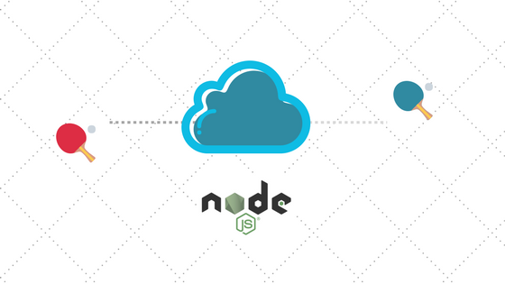

# node-pong



## Summary

Every time a developer wants to check if a site/API is up and running, usually a PING is made on a IP and PORT. Sometimes I want to check if my service is up on a determined PORT, or even if my request is going through the firewall/router/switch the way I expect.

So I wanted to have a simple project that I'm able to quick use it for testing purposes.

**``This is a simple project that provides API endpoints that answers to HTTP requests.``**

## Project Name

The name is simply inspired on the PING-PONG interaction, NOT on the PONG Game!

## Install

```bash
npm install node-pong
```

## Use

Create a Node.js (e.g. nodePongTest.js) file and insert:

```nodejs
let nodePong = require('node-pong');
```

or type this on your terminal:

```bash
echo "let nodePong = require('node-pong');">nodePongTest.js
```

## Run

```bash
node nodePongTest.js
```

and you should see the server running:

```bash
server running on port 13420
```


## Main endpoint

### ``/ping``

The main endpoint for all the action on this package is ``/ping``. Every port that is provided to be listened by the server will have this endpoint.

## Check response

Now you only have to check if the server is responding using any language/program you want. Example:

```bash
curl http://localhost:13420/ping
```

and you should see a response (drum roll)

```bash
pong
```

### Other response formats

Since version 1.2.0 it's possible to get the response in other format than plain text.

- HTML
- JSON
- XML

#### HTML

```bash
curl -H "Accept: text/html" http://localhost:13420/ping
```

```html
<!DOCTYPE html>
<html lang="en">

<head>
    <meta charset="UTF-8">
    <title>node-pong response</title>
</head>

<body>
    <h1>pong</h1>
</body>

</html>
```

#### JSON

```bash
curl -H "Accept: application/json" http://localhost:13420/ping
```

```json
{
    "headers": {
        "host": "localhost:13420",
        "user-agent": "curl/7.54.0",
        "accept": "application/json"
    },
    "method": "GET",
    "url": "/ping",
    "body": "{\"answer\": \"pong\"}"
}
```

#### XML

```bash
curl -H "Accept: application/xml" http://localhost:13420/ping
```

```xml
<?xml version="1.0" encoding="utf-8" ?>
<answer>pong</answer>
```

### Multiple HTTP ACCEPT HEADERS

We want just one kind of response, so **IF** multiple **ACCEPT** headers are found, the **FIRST** one on the following order will be the response:

1. JSON
2. HTML
3. XML

In the case of no header is identified or is incorrect, the plain answer **``pong``** will be given.

## Additional endpoints

### ``/ports``

If you want to check which ports your server is listning to, than use this endpoint.

```bash
curl http://localhost:13420/ports
```

```json
["13420"]
```

## Configuration file

On version 1.1.0 a configuration file was added. You can copy it from the ``node_modules/node-pong`` directory:

```bash
cp node_modules/node-pong/node-pong.json .
```

or create it manually:

### node-pong.json

```json
{
    "_comment": "##########################\n\nThis is the configuration file for node-pong.\n\nports: array of ports for node-pong listen to. If no port is informed, or no node-pong.json file is found, it will listen on the default port 13420.\n\nserverMessage: should be a message that is shown on the console when the server is listening on the desired port, on the form of:\n\nserverMessage: port\n\n##########################\n",
    "ports": ["13420"],
    "serverMessage": "The server is running on port: "
}
```

- ``_comment``: The message you want to show on the console;
- ``ports``: An array of ports that the server must listen to.
  - You can specify one by one or a range of ports;
  - Range will not check if the ``startPort`` is bigger than the ``endPort``, so you must supply the range in the correct order. E.g.: 
    - **correct: 10-20**;
    - <s>**wrong: 20-10**;</s>
  - NaN will just throw a "``-> not a valid port``" message on the console, but will not throw any error or interrupt other listening ports;
- ``serverMessage``: The message shown in the console when the server is started. It'll be one for each listened port;

**``NOTE1``**: If no configuration file is found or if the name is not correct (``node-pong.json``), than the server will be started just like on version 1.0.0, listening on the default port ``13420``.

**``NOTE2``**: As of one of my goals it to have the fewer dependencies possible, I opted for use the configuration file in json format, not on YAML or any other.

## Goals

Provide a simple API able to answer to HTTP requests, enabling our project to:

- <s>Provide a default API endpoint "/ping" on a predefined default port;</s>
- <s>Respond to ping requests on a default port;</s>
- <s>Respond with a default answer "PONG";</s>
- <s>Provide different type of responses other than the default plain text (HTML, JSON, XML)</s>
- <s>Fewer dependencies as possible or no dependencies at all</s>
- Implement in-memory list of ports, with or without file persistence, for dynamic project configuration;
- <s>OPTIONAL: respond to ping requests on several ports;</s>
- OPTIONAL: respond with a customized answer on the default port;
- OPTIONAL: respond with a customized answer on several different ports;

## TODO

- Implement every OPTIONAL goal described above;
- Create tests using Mocha or another framework;
- Implement a continuous delivery process;

## Release notes

### 1.2.5

- Added a simple Mocha test for testing ``/ping`` on the default port. Test every response type (plain, json, html and xml);
- Also test the ``/ports`` endpoint;
- fixed a bug when no header for "Accept" was defined, the request crashed the server;
- Added close() function to close server;
- jumped to this version number because of my npm not publishing correctly. Ignore versions 1.2.1 through 1.2.4.

### 1.2.0

- Added "/ports" endpoint to check which ports the server is listening to;
- Response in multiple formats based on HTTP headers (html, json, xml)

### 1.1.1

- Fixed loading ``node-pong.json`` from current dir(``./``), now using ``process.cwd()``;
- Goals updated - added dynamic port configuration wish;
- Added more keywords for the package;

### 1.1.0

- Added the ability of listening on multiple ports;
- Added the ability of custom "server running" message;

### 1.0.1

- Fixing README and deploy error;

### 1.0.0

- It's the MVP for this package;
- Simplest implementation ever;
- no dependencies;
- no logs;
- no tests;
- no parameters for start listening on a different port;
